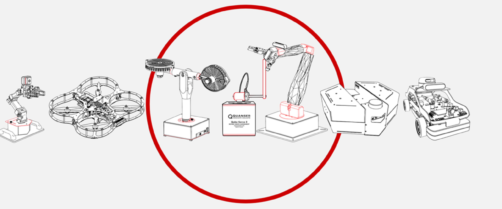

<div align="center" style="margin-bottom:24px;">
  <div style="width:100%; max-width:1300px; aspect-ratio: 2 / 1; overflow:hidden; border-radius:9px;">
    
  </div>
</div>


# Quanser Research Guide
Welcome to the Quanser Research Resources!

This directory contains research examples across Quanser platforms including robotics,Isaac Sim, control systems, AI, and autonomous systems.

---

## Platforms & Research Areas

*Research Categories*

- Aero2  
- Applied AI
- Autonomous vehicles
- Isaac Sim
- Mechatronics Trainers
- Multi-Agent Systems  
- PAL Utilities  
- QArm  
- QArm Mini  
- QBot Platform  
- QBot Platform Alpha  
- Qube Servo  
- SDCS  

**Note:** The Autonomous Vehicles folder has examples for QDrone, QDrone 2, QBot 2, QBot 2e, QBot 3.  The SDCS folder has examples for QCar, QCar 2 and the Traffic Light. 

---
## Repository Structure

```
1-setup/
2-quick-start-guides/
3-user-manuals/
4-concept-reviews/
5-research/
6-teaching/
```

---

## Getting Started
Before running any research example please make sure you have gone through the following steps:

1. Follow the instructions under [**1-setup**](/1_setup)  to ensure your lab PC is configured correctly. 
2. For quick device level tests and getting started please review  [**2-quick start guides**](/2_quick_start_guides/) to become familiar with the products you have available. 
3. Before using Quanser’s products, be sure to read the user manuals located in 
[**3-user manuals**](/3_user_manuals).

Use the following table to identify which development emvironemnts meet your research needs


## Development Environments

| Platform | MATLAB/Simulink | Python | ROS |
|---------|----------------|--------|-----|
| Aero2 | ✓ | ✓ | X |
| Applied AI | ✓ | ✓ | X |
| Autonomous Vehicles | ✓ | ✓ | X |
| Isaac Sim | X | X | ✓ |
| Mechatronics Trainers | ✓ | ✓ | X |
| Multi-Agent | ✓ | ✓ | X |
| PAL Utilities | ✓ | ✓ | X |
| QArm | ✓ | ✓ | ✓ |
| QArm Mini | ✓ | ✓ | X |
| QBot Platform | ✓ | ✓ | ✓ |
| QBot Platform Alpha | ✓ | ✓ | X |
| Qube Servo | ✓ | ✓ | X |
| SDCS | ✓ | ✓ | ✓ |

---
## Considerations
Prior to getting started with research metrial, make sure you're comfortable answering the following questions:

1.	If the system at your institution has curriculum content available have you had an opportunity to go through it and understood the operating constraints of the system?
2.	Does your knowledge of these development environments meet a minimum threshold? The following are considerations and questions to ask yourself before getting stated.
  - For MATLAB/Simulink examples, do you know how to:
      1. Get around a Simulink model, drop in blocks, set the step size for a model, specify the target device that code will compile for, where the code is actually running? See the [Simulink Onramp](https://matlabacademy.mathworks.com/details/simulink-onramp/simulink) for more help with getting started with Simulink. 
      2. 	Checked out the list of available QUARC blocks to help you get started? If you haven’t please take a look at the [QUARC demos](https://docs.quanser.com/quarc/documentation/quarc_demos.html) to get an understanding of the core functionalities that Quanser has put together.  

 - 	For Python users do you know how to:
    1.	Import and call libraries inside a python script?
    2.	Understand the basics of timing and how to enfor specific time step during a python application?
    3.	Understand whether or not the example is designed for the host computer or the actual Quanser device? 
        - **Ex:** for devices like the QCar 2 you can run python examples locally on the QCar to read data and perform a task. This requires you to copy and run files on the system. Do you have an understanding of how to complete these steps? 
  -	For ROS users do you know how to:
    1.	Compile your ROS distro? 
    2.	Created a python/C++ ROS node in the past?
    3.	Understand the differences between ROS 1 and ROS 2 distributions?
    4.	Understand how worskpaces, packages, nodes work and their folder structure?

## Notes

Autonomous Vehicles (Drone Research Lab) include:

- QDrone / QDrone 2  
- QBot 2 / 2e / 3  

SDCS (Self-Driving Car Lab) includes:

- QCar / QCar 2  
- Traffic Light system  

---

## License

© 2025 Quanser Consulting Inc.  
All rights reserved.

---

## Contact

Quanser Consulting Inc.  
Markham, Ontario, Canada  

http://www.quanser.com  
info@quanser.com
