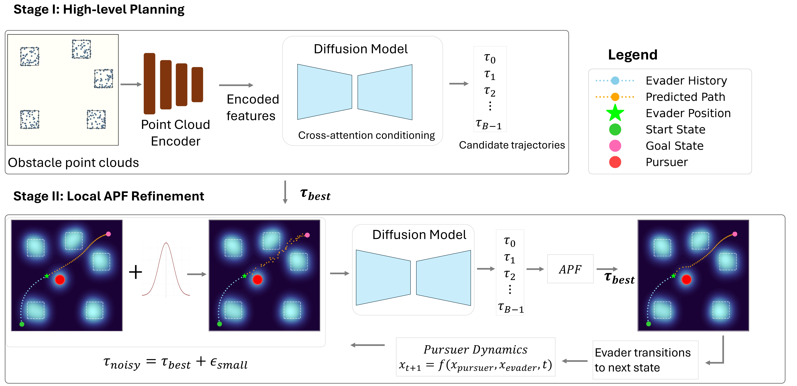

# Real-Time Adaptive Motion Planning via Diffusion + Potential Fields

![RAMP repository overview screenshot]
<!-- Image source: wondmgezahu/RAMP repository (README), branch: main. -->

## Overview

RAMP is a real-time planner that generates trajectories directly from **obstacle point clouds**. It combines:

- a **point-cloud guided, energy-based diffusion** planner (global trajectory proposals), with
- **potential-field refinement** (local last-meter collision avoidance),

and supports **online refinement** when a moving threat (a “pursuer”) gets close.

**Catch:** it is a hybrid “learned global planner + reactive safety correction” approach designed for fast replanning.

---

## How the Quanser Community Can Use This

- **Fast start for teaching/research:** run the repo’s QCar demo, then change one knob (obstacles, sensor, safety distance, speed).
- **Add a pursuer:** use a second QCar as the moving “threat” and test replanning.
- **Make your own maps:** auto-generate obstacle layouts + start/goal pairs for repeatable tests.
- **Benchmark planners:** compare APF, RRT/BIT*, optimization, RL, and diffusion with the same metrics.
- **Increase difficulty easily:** add clutter, moving obstacles, uncertainty, tighter limits.
- **Extend projects:** swap sensors, tune the cost (smoother/safer/faster), or go multi-agent.

---

## Experimental Setup

- **Platform:** QCar1
- **Task:** obstacle avoidance and pursuit–evasion planning from point-cloud obstacles
- **Data:** synthetic obstacle layouts + start/goal pairs + diverse trajectories (dataset generation scripts)

---

## Stack / Tags

**Tags:** `QCar` `Motion planning` `Point clouds` `Diffusion` `Potential fields` `Pursuit–evasion`

---

## Links

- **GitHub Repository:**
  https://github.com/wondmgezahu/RAMP

- **Paper (arXiv):**
  https://arxiv.org/abs/2507.09383

---

## Author Preferred Contact

For questions or discussion, please use **[GitHub Issues](https://github.com/wondmgezahu/RAMP/issues)** on the project repository. For direct contact, the preferred emails are **[teshome.w@northeastern.edu](mailto:teshome.w@northeastern.edu)** and **[behzad.k@northeastern.edu](mailto:behzad.k@northeastern.edu)**.

---

## Authors

Wondmgezahu Teshome · Kian Behzad · Octavia Camps · Michael Everett · Milad Siami · Mario Sznaier
